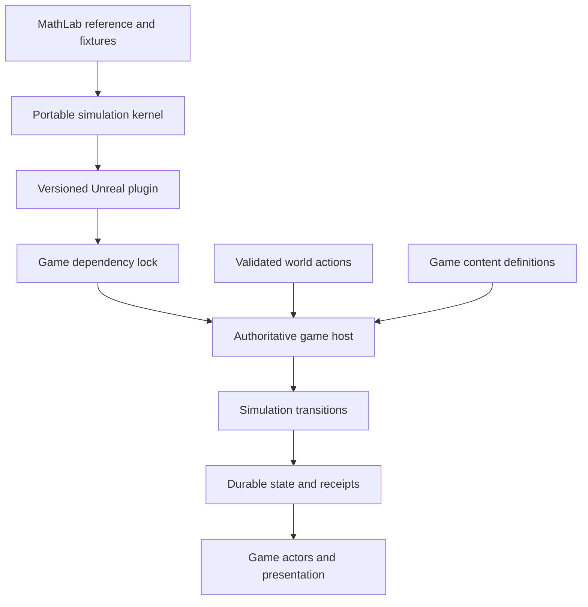
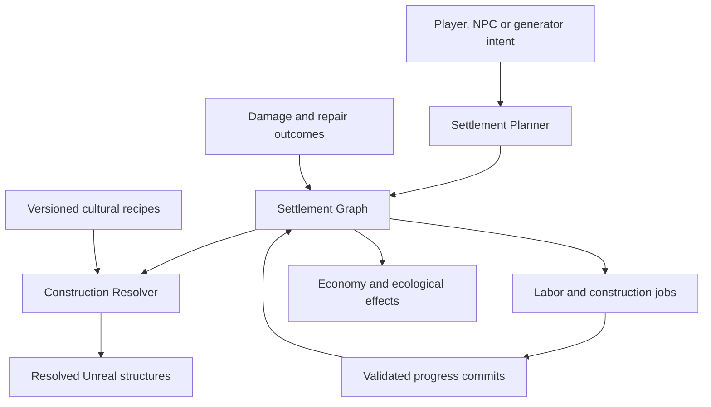

# MathLab producer — standalone repository handoff

Planning revision 5 · 15 September 2026. Copy this complete file into its target repository as the working plan. It embeds the package contract and relevant canonical requirements. Any counterpart links provide context; the required scope and first actions are included here. All extraction, implementation and release work remains planned.

## Included sections

- [MathLab repository plan](#18-mathlab-repository-plan)
- [MathLab → Unreal game package contract](#20-mathlab-unreal-package-contract)
- [World simulation and persistent consequences](#13-world-simulation-and-consequences)
- [Systemic settlements and procedural construction](#16-settlements-and-procedural-construction)
- [Magical labor, domains and emergent civilization](#17-magical-labor-and-civilization)
- [Acceptance for persistent worlds, settlements and magical civilization](#15-world-acceptance)

---

# MathLab repository plan

**Repository: [davgor/FantasyWorldGenerator](https://github.com/davgor/FantasyWorldGenerator), created by the user.** This is the MathLab producer plan for the local agent. User ownership: independent simulation work, using the developer/model of your choice. Extract the existing MathLab from `davgor/icarusUnreal`, evolve its portable simulation, and publish a versioned Unreal plugin consumed by the separate new game. This repository does not own the anime game or depend on its source/assets.

**Status:** planning and read-only source review. No repository was created, no files were removed from IcarusUnreal, no simulation code was changed and no package was built/published. Source baseline verified at `d551767cb1c3bd259bb00f56be1e52c2182c5ec3` on 15 September 2026. All new repo/ticket/module names are proposed.

## Existing foundation and its actual limits

| Existing source | Available foundation | Not established by that source |
| --- | --- | --- |
| [Sim README](https://github.com/davgor/icarusUnreal/blob/d551767cb1c3bd259bb00f56be1e52c2182c5ec3/Sim/README.md), `terrain_lab.py` | Python 3.12 standard-library terrain reference, Config/generate entry points | No Unreal runtime plugin; README explicitly says old world-time/events were not included |
| [terrain_world.py](https://github.com/davgor/icarusUnreal/blob/d551767cb1c3bd259bb00f56be1e52c2182c5ec3/Sim/icarus_sim/terrain_world.py) | Recipe 1, validated seed/overrides, parameter registry and independent named networks | No persistent accepted-action/advance-interval API |
| [terrain_ecology.py](https://github.com/davgor/icarusUnreal/blob/d551767cb1c3bd259bb00f56be1e52c2182c5ec3/Sim/icarus_sim/terrain_ecology.py), [layered-world docs](https://github.com/davgor/icarusUnreal/blob/d551767cb1c3bd259bb00f56be1e52c2182c5ec3/docs/terrain-world-layers.md) | Geography/habitat overlays, independent magical fields and sampled risk/opportunity | No repeated-cast residue → mature-node lifecycle or live ecological population simulation |
| [terrain_settlements.py](https://github.com/davgor/icarusUnreal/blob/d551767cb1c3bd259bb00f56be1e52c2182c5ec3/Sim/icarus_sim/terrain_settlements.py) | `settlements.version = 8`, deterministic building-pack/layout proposals, terrain-aware sites/bridges | Candidate cities/layouts, not funded player construction, persistent component damage or a complete Settlement Graph lifecycle |
| [terrain_humans.py](https://github.com/davgor/icarusUnreal/blob/d551767cb1c3bd259bb00f56be1e52c2182c5ec3/Sim/icarus_sim/terrain_humans.py), [terrain_society.py](https://github.com/davgor/icarusUnreal/blob/d551767cb1c3bd259bb00f56be1e52c2182c5ec3/Sim/icarus_sim/terrain_society.py) | Catchments, culture-link groups, roads/hamlets/fortress proposals and bounded supply diagnostics | Seed-local culture groups are not ethnicity/politics; fortress garrisons and live labor are not modeled; diagnostic supply is not a live economy |
| [terrain_nests.py](https://github.com/davgor/icarusUnreal/blob/d551767cb1c3bd259bb00f56be1e52c2182c5ec3/Sim/icarus_sim/terrain_nests.py), [nest tests](https://github.com/davgor/icarusUnreal/blob/d551767cb1c3bd259bb00f56be1e52c2182c5ec3/Sim/tests/test_terrain_nests.py) | Static habitat-anchor proposals and bounded placement; documentation reports 381 species profiles | No actual creatures, hostility, prey accounting, binding or Unreal spawning |
| [lab server](https://github.com/davgor/icarusUnreal/blob/d551767cb1c3bd259bb00f56be1e52c2182c5ec3/tools/terrain_lab.py) | Browser workbench and world-generation endpoint | Development inspection, not production session authority |
| [revision register](https://github.com/davgor/icarusUnreal/blob/d551767cb1c3bd259bb00f56be1e52c2182c5ec3/docs/mathlab-revisions.json) and inspected tests | Explicit live revisions and regression specifications | Tests were inspected, not run during this planning task; historical passes are not a fresh baseline |

Current named network keys are exactly `weave`, `umbral`, `infernal`, `holy`, `primordial`. The new game's illustrative Necrotic/Nature/Radiant/Arcane/Storm/etc. taxonomy needs explicit semantic mapping/versioning. Do not silently map Necrotic to Umbral or Nature to Primordial, reuse an old opposition law as settled new balance, or treat a population-risk scalar as the whole magical composition.

## Extraction scope and sequence

1. Freeze the chosen source commit at extraction time and record any changes since this review. Preserve the original checkout and uncommitted work; this is a scoped extraction, not a deletion/migration of the old game.
2. Use the existing `davgor/FantasyWorldGenerator` repository; do not create another destination. Inspect its current state and preserve existing files/work. Preserve the imported directory layout until a clean standalone baseline passes; path cleanup can follow with its own tests.
3. Copy the allowlisted code/data/tests/tools and their required provenance/config dependencies below. Scan imports, file reads, CI scripts and tests for paths outside the new repo. Do not claim isolation until the original checkout is absent from the test environment.
4. Run the existing Python suite and browser/CLI/export smoke tests. Record actual baseline failures without rewriting expected results merely to obtain a pass.
5. Record an extraction manifest: source repo/commit/path/blob or content hash → destination path/hash, reason, included dependencies and license/provenance. Preserve archived source/reference material without modifying its history.
6. Add repo-specific README, AGENTS instructions, docs map, board, CI, contracts and package release workflow. Carry the preservation principle forward with explicit versioned revisions; do not copy old instructions requiring the IcarusUnreal editor identity into the independent repo.
7. Establish the native runtime/plugin proof and publish only after its scoped package gates pass. The original game repo remains a historical consumer/reference unless separately retired later.

| Extraction category | Initial paths / handling |
| --- | --- |
| Portable code and colocated profiles | `Sim/icarus_sim/` including Python modules and JSON profile/recipe data; preserve `Sim/README.md` |
| Regression suite | `Sim/tests/` and every fixture/input it actually reads |
| Lab UI and server | `tools/terrain_lab.py`, `tools/terrain_lab.html`, `tools/terrain_world.js`; inspect any additional resolved imports before copying |
| Known external-to-Sim test dependency | `docs/catalogue/creatures.json`: nest coverage test reads it through the repository root; include a versioned snapshot initially or deliberately replace with an equivalent pinned contract fixture |
| Canonical lab docs | `docs/terrain-math-lab.md`, `docs/terrain-world-layers.md`, `docs/mathlab-revisions.json`; preservation/baseline manifests and relevant LAB tickets/reviews/biome-gate decision |
| Historical provenance | Relevant protected reference snapshots and notices; retain origin/hashes even if archived paths are relocated |
| CI/config | Extract only relevant terrain/preservation/test commands and declared runtime/test dependencies; replace monorepo/game assumptions with standalone checks |
| Stay with the game/reference | IcarusCreator code, `.uproject`, Unreal game assets, MetaHuman/DNA bindings, outfits, animation binaries, purchased art, game-specific authoring skills and unrelated tools |

The allowlist is an extraction plan, not a certified complete dependency closure. The known creature-catalogue read must not be lost by copying only `Sim/`. Generic species/culture/recipe simulation definitions become versioned MathLab inputs; game art/bindings retain their own ownership. Avoid two independently edited catalogues with the same semantic IDs. File-copy extraction with provenance is acceptable; preserving filtered Git history is an alternative to choose when executing, not a reason to rewrite the source repo.

Existing baseline commands, from the extracted root with equivalent paths: `PYTHONPATH=Sim python -m unittest discover -s Sim/tests -q` and `python tools/terrain_lab.py --serve`. Adapt environment syntax for the host shell. Run new standalone CI rather than assuming the original PowerShell game-wide wrapper is portable. No command was executed against a full MathLab checkout in this review.

## Repository layout and build independence

| Proposed area | Responsibility |
| --- | --- |
| `Sim/`, `tools/` | Preserved Python reference and browser workbench; ordinary development without Unreal |
| `Core/` | Portable native simulation implementation and its headless tests |
| `Contracts/`, `Fixtures/` | Versioned schemas, taxonomy/ID registry, semantic examples, conformance cases and expected outcomes |
| `Unreal/MathLabRuntime/` | Generic runtime plugin wrapper and optional separate editor module; no game-specific asset bindings |
| `Tests/UnrealConsumer/` | Minimal plugin consumer used for engine/cooked package qualification |
| `docs/`, `board/`, `provenance/` | Canonical requirements, work tickets, actual evidence, open decisions and extraction history |
| `release/` tooling | Build/export/manifest checks and immutable package publication; generated releases are artifacts |

The proposed C++ kernel and plugin are new work. Keep the current Python baseline running while moving one supported rule at a time into a tested runtime core. Prefer workbench access to the same core once practical; if Python remains an independent oracle, every changed rule updates reviewed conformance cases in this repo. No duplicated shipping solver in the game repo.

## Rules assigned to MathLab

| Domain | MathLab owns | Game supplies / consumes |
| --- | --- | --- |
| World genesis | Terrain/climate/water/biome/habitat fields, stable layer/seed contracts, site/layout proposals | Validated definition inputs; actual Unreal terrain, materials and placement |
| Structural consequences | Portable material eligibility, component damage/support failure, abstract critical-rubble outcomes and repair rules | Accepted hit IDs/magnitude and authored component/support/proxy definitions; Chaos/collision/nav execution |
| Magic | Explicit source accounting, temporary residue, persistent node formation/growth/suppression, composition interactions/propagation | Accepted spell/work/source events; presentation and UI |
| Environment/ecology | Exposure/conditions, equilibrium/extremes/recovery, population/hideout/resource budgets | Creature/habitat capabilities; real actor spawning and feedback from encounters |
| Settlement model | Graph/territory/district/plot state, logical constraints, generic recipe selection, construction/job rules and reconstruction | Authored module/terrain/access capabilities and accepted construction intent; geometry/tools/interactions |
| Workforce/economy | Living versus magical workers, reservations, useful production, input consumption, bounded logistics and source emissions | Actual accepted work/combat/death/controller events and content task capabilities |
| Magical infrastructure | Soul Forge/equivalent operational state, targets/capacity/inputs, emission and binding consequences | Constructed anchors, local interactions and visual state |
| Wells/domains | Concentration/spread field rules, attunement/control, overlap and modifier eligibility data | Accepted strategic actions, game cost/effect application, border/anchor presentation |
| Strategy and knowledge | Semantic incidents, observation/report models, evidence/confidence, forecasts, feasible faction responses | Supported observations; actors/travel/dialogue/combat outcomes; optional LLM proposals through validation |
| Civilization/history | State-derived classification and causal historical initialization/evolution | Original cultural content and physical explorable ruins |
| Persistence/time | Portable state/events/serialization, stable identities, rule migrations, bounded step/replay and checkpoints | Game-owned durable storage, session clock/authority, networking and transaction commit |

MathLab does not own body/face fitting, hair/ear/tail physics, character/outfit UI, apparel assets, combat input/animation/hit detection, Chaos trajectories, actual NavMesh, local behavior trees/perception, save-file durability, network transport or LLM deployment. Numeric work in those areas is not automatically a MathLab responsibility.

## Required simulation outcomes

Use one ruleset for player, NPC and generated content. Structures progress through intact/damaged/collapse outcomes to persistent ruins with stable component identities; critical breaches/rubble remain meaningful after reload. A seed selects presentation but does not replace damage state or guarantee Chaos trajectories. Support solver complexity and authoring granularity remain bounded design choices.

Temporary residue accumulates from accepted defined sources and can dissipate without a permanent node. Sustained conditions can form and strengthen persistent nodes, including compatible-node reinforcement/spread. Composition, amount/intensity, stability and compatibility remain distinct. Explicitly decide summon-event, maintained-worker, useful-work and infrastructure contributions; operating automated infrastructure must emit influence. Never emit unbounded residue per render frame. Death residue/mass reanimation remain separately specified extensions.

Every approved major school eventually offers attractive regional labor, equivalent automation and dangerous extremes. Necrotic, Nature, Radiant/Holy, Infernal, Arcane, Storm/Elemental, Umbral and World Weave labels are candidates pending taxonomy reconciliation. Magic must solve meaningful manpower/productivity constraints; conventional labor remains useful because sustained magical reliance has ecological costs. Measure useful advantage before Wells rather than making magic weak to force civilians.

Equilibrium is local stability, not moral alignment or equal channel shares. Nature overgrowth and Radiant excess are dangerous alongside necrotic/infernal/arcane extremes. Mixed influences can differ; restoration changes conditions/composition and may overshoot from necrotic wasteland through recovery into hostile Nature wilderness. Mature nodes, damaged structures, dead residents and politics recover independently.

The Settlement Graph models camps through cities/citadels and derived types. Direct placements, structural fortifications and district development share a planner/resolver and jobs. Culture supplies the base grammar; magic mutates eligible existing buildings and recipe eligibility. Human + Necrotic remains culturally distinct from Elven/Dwarven + Necrotic. Preserve ownership, named identities, component damage and protected player plans across updates.

Jobs consume real inputs/work once, including distant simulation. Magical workers are not automatically living residents. Soul Forge-like infrastructure creates/maintains a configured workforce, consumes resources, provides useful automation and emits ongoing influence. Shutdown, starvation, control loss and capture need explicit rules. Large output cannot require unlimited agents, spawns or event work.

Advanced Magic Wells concentrate influence inside a domain and greatly reduce outward diffusion, with substantial local benefits and dense hazards. Treat the constructed Well, leyline node and domain as different concepts. Define flow/source/sink accounting, local bonuses, overlap and strategic capture/retuning/loss. Potential zero costs still respect action/control/spawn budgets. Capturing a Well does not automatically annex political territory or override every creature's existing controller.

Ambient undead initially remain hostile to novice necromancers. Bound undead follow their binding. Later caution/neutrality/submission depends on supported authority, power, saturation, reputation, node/domain control, existing master and intelligence. Apply equivalent independence to other schools; no outfit/class flag creates allegiance.

Faction decisions use supported knowledge, historical understanding, observed trends, confidence, resources, travel, relationships/treaties and prior outcomes. Friendly rulers can warn, offer conventional workers, negotiate, sanction, contain or intervene against severe risk. War remains conditional; an LLM is optional and cannot invent facts/resources. Villains understand the system, but section 21 supplied only that heading, so detailed manipulation tactics are not locked requirements.

Classify civilization from real population/workforce, culture, buildings/infrastructure, economy, military, territory and magic with explained transitions/hysteresis. Historical Nature/Radiant/Arcane/Necrotic failures become physically explorable sites in the game; MathLab proves bounded causal scenarios and clearly distinguishes authored genesis from simulated history.

## Independent ticket sequence

These new `ML-*` IDs belong to this plan; they are not existing `LAB-*` completion claims. Their dependencies are entirely within MathLab plus a supported Unreal SDK for plugin gates. They do not wait for character assets or a playable game.

| Ticket | Deliverable | Depends on | Required evidence |
| --- | --- | --- | --- |
| ML-00 | Extract repository/dependency closure, preserve provenance and rerun baseline | — | PK01; original checkout unavailable, browser/CLI/tests work, real failures recorded |
| ML-01 | Contract/taxonomy/IDs/units/version registry and conformance fixtures | ML-00 | Explicit old/new channel mapping decisions; independent seeds and invalid-input cases |
| ML-02 | Bounded state/time/event kernel with pure headless transition proof | ML-01 | Duplicate/reordered/retried inputs, checkpoint/replay and explicit numeric contract |
| ML-03 | Native world generate + Unreal plugin + UnrealWorldGen importer + packaged generate→materialize (see board ML-03/d/e) | ML-02 | PK02–04/06/08/10; `.uplugin`; in-process genesis not Python; Z-up importer; cooked Win64 digest |
| ML-04 | Abstract component/material/support damage and repair model | ML-02 | Persistent breach/blocker/surviving targets; no Chaos requirement in rule fixtures |
| ML-05 | Residue, node lifecycle and bounded propagation | ML-02 | Brief versus sustained sources, suppression, mixed/compatible links, no duplicate emission |
| ML-06 | Persistent settlement graph, genesis adapter and logical construction plans | ML-01/02 | Convert candidate city layouts without pretending estimates are live state; claims/district/IDs/invalid plans |
| ML-07 | Actual workforce/economy/jobs and strong magical labor in two schools | ML-05/06 | Input/output/reservation correctness, living/magical distinction and measured task advantage |
| ML-08 | Multi-school ecology/extremes, recovery and ambient authority rules | ML-05/07 | Actual budgeted threats/populations, Nature/Radiant excess, restoration overshoot, independent creatures |
| ML-09 | Soul Forge plus another school infrastructure; district growth/reconstruction | ML-04/06/07 | Operation emissions, starvation/capture/control behavior, protected plots and funded repair |
| ML-10 | Wells/domains/borders and strategic transitions | ML-05/08/09 | Concentration/spread exchange, bounded overlaps, no free infinite loops, independent ownership/lifecycles |
| ML-11 | Knowledge, reports, risk forecasts and feasible faction strategy | ML-06/08/09 | Delayed uncertain information, worker aid and conditional escalation; no LLM dependency |
| ML-12 | Civilization classifier and causal historical scenarios | ML-08/09/11 | Explained classifications, stable identity, bounded history and recovery |
| ML-13 | Full declared school/type coverage, stress/catch-up and package release series | ML-03/04/10/11/12 | All supported rule suites, scoped performance, compatibility manifest and repeatable plugin releases |

ML-03 proves packaging early; it does not block further Python rule experiments while engine CI is unavailable. However a rule is not advertised as runtime-supported until its native/core implementation and plugin consumer conformance pass. Publish incremental capability releases after that proof; do not wait for ML-13 to give the game its first useful package.

## Acceptance, maintenance and first action

Each ticket must state requested behavior, proposed mechanism, unresolved balance, consulted sources, changed files and observed evidence. Pure fixtures cover state/cost/event invariants, not merely values reread from the implementation. Keep critical threshold decisions stable under the declared numeric contract; version intentional legacy behavior changes. Use PK01–10 from the package contract and relevant WA/SA requirements in the supporting design sections of the standalone handoff.

New biome/habitat definitions require MathLab behavior/distribution/transition evidence before the game produces dependent biome content, following the retained [biome validation decision](https://github.com/davgor/icarusUnreal/blob/d551767cb1c3bd259bb00f56be1e52c2182c5ec3/docs/decisions/014-mathlab-biome-gate.md). This gate does not block neutral creator rooms, base bodies or unrelated authored game assets.

Keep fast Python/core CI separate from Unreal package CI. The latter needs an available, properly configured supported engine/toolchain runner and a clean minimal consumer. A green Python suite cannot publish a release labeled cooked-runtime validated. Retain failed fixtures, performance workload/limits, source/artifact hashes and migration evidence. Release mechanics and permission setup are implementation tasks, not done by describing a workflow.

First local-agent action in `FantasyWorldGenerator`: read this complete plan, inspect the working tree/instructions, then execute ML-00 and ML-01/02, preserving the source reference while establishing the minimal ML-03 plugin proof. The repository name is settled; choose plugin/module names, engine target, CI runner and artifact channel as recorded setup decisions. Do not redesign all ecology before establishing extraction and package viability.

---

# MathLab → Unreal game package contract

**Contract draft 1, planning revision 5.** Requested boundary: `davgor/FantasyWorldGenerator` owns MathLab and publishes a versioned Unreal plugin; the new anime game repository consumes that package. The user has created the MathLab destination repo. Game repository, plugin/module and API names below remain proposals. No MathLab code extraction, plugin build, release or runtime integration was executed by this planning task.

## Ownership and dependency direction

MathLab owns generic simulation definitions, schemas, rule implementation, reproducible fixtures and the Unreal plugin wrapper. The game owns content bindings, playable actions, input/UI, physical presentation, local actor AI, save storage/session authority and packaging of the complete game. MathLab has no dependency on the game repository, its `.uproject`, `/Game` asset paths or IcarusCreator/MetaHuman classes. A minimal consumer test project may live in MathLab to qualify its plugin.

Repository independence is a build/release boundary, not two live authorities. The game hosts one authoritative simulation instance and invokes the installed plugin. A separate browser lab is an isolated experiment, never a second writer to a running world. Later distributed execution requires explicit ownership epochs and transfer contracts; it is not implied by having two repos.

## What the Unreal package contains

The required deliverable is a runtime-capable Unreal code plugin with a `.uplugin` descriptor, runtime module/build definitions, public API and supported rule/schema data. Proposed implementation: a portable native C++ kernel plus a thin Unreal runtime wrapper, with optional editor-only diagnostics in a separate module. Retain Python as the existing reference/workbench and use conformance fixtures while moving supported production rules into the kernel. Both implementations, where temporarily necessary, belong to MathLab; the game must not grow its own copy of the formulas.

This is an implementation proposal to prove early, not an existing automatic Python-to-C++ exporter. Epic documents code plugins and separate runtime/editor modules in its [plugin guide](https://dev.epicgames.com/documentation/en-us/unreal-engine/plugins-in-unreal-engine). Its [Python guide](https://dev.epicgames.com/documentation/en-us/unreal-engine/scripting-the-unreal-editor-using-python) identifies the built-in Python environment as editor tooling, not packaged gameplay. Therefore copying the current Python lab into a plugin is not the runtime plan. Embedding another interpreter or depending on a running Python server would require a separate deliberate change to this architecture.

A source-inclusive plugin archive is the proposed baseline for independent distribution; validated precompiled binaries may be included for named engine/toolchain/platform/target combinations. An engine descriptor version is not proof of binary compatibility. Package qualification must actually compile/load the plugin and execute a cooked consumer. Ordinary MathLab Python/core work should not require an Unreal installation; only plugin build/acceptance jobs do.

An export-only baseline may publish world genesis/data and inspection tools, explicitly labeled without live simulation capability. Dynamic residue, jobs, nodes and factions require a runtime kernel release. A successful JSON export or editor import cannot mark that gate complete.

## Release and consumption contract

| Release metadata | Required meaning |
| --- | --- |
| Identity | Package name/version, immutable artifact identifier/checksum, MathLab source commit and contract digest |
| Compatibility | Exact tested Unreal patch/build, toolchain, platform, architecture and Editor/Development/Shipping targets; source-build requirements |
| Behavior | Rule, taxonomy, generator/seed, snapshot/event and content-definition schema versions; supported capability list |
| Contents | Plugin source and qualified binaries/data, public contract, license/provenance notices, migration notes and fixture/evidence manifest |
| Evidence | Core/reference comparison, clean consumer compile/load, cooked execution, save round-trip and scoped performance result; remaining gaps |
| Upgrade | Compatible versions, required state/content migrations, retired IDs and rollback constraints |

The game commits a proposed `Dependencies/mathlab.lock.json` naming an exact version/artifact digest and compatible rule/schema set. Fetch/install into the project's `Plugins/` area in a reproducible build step; the installed package is a dependency, not an editable source fork. Do not consume floating `main`, automatically install “latest,” or silently retune old saves on startup. Package distribution can use private release artifacts or another chosen registry; no public marketplace publication is required by this plan.

An upgrade is a reviewable game dependency change: verify digest/version, compile, run shared fixtures and game adapter tests, load copied representative saves, perform a packaged gameplay smoke test, then adopt the lock change. Preserve previous package and save generations. If a migration is irreversible, rollback restores the compatible prior save/package pair; changing the lock alone cannot make a newer save readable by old code. Never update a running session's rules midway through an owned interval.

## Portable commands and state

Names below describe intended operations, not existing exported functions. Supported capabilities are declared per release; unknown commands fail explicitly instead of falling back to fake simulation.

| Operation | Input | Output / boundary |
| --- | --- | --- |
| Describe capabilities | Package/API version | Supported rules/schemas/taxonomy/features and numeric/time contract |
| Generate genesis | Versioned world recipe, seed streams, parameters and generic content capabilities | Terrain/region fields and proposed sites/layouts with provenance; explicit initialization creates live identities |
| Initialize/import state | Approved genesis, stable IDs, definition revisions and saved overrides | Validated initial snapshot; no regeneration over an existing occupied world |
| Evaluate accepted command | World/actor/target identity, action/effect ID, authority epoch, expected state revision, simulation time, payload and definition revisions | Validated transition proposal, rejected command or explicit pending work |
| Advance bounded interval | Committed snapshot, ordered accepted events, start/target simulation time and work budget | State delta, semantic events, receipts, diagnostics and resumable progress; completed time never advances over unprocessed consequences |
| Query | Snapshot revision plus region/settlement/component/knowledge/domain request | Read-only values; no mutation from inspection or previews |
| Validate/serialize/migrate | Schema/versioned snapshot and definition set | Validated portable state or explicit failure/migration plan; durable file/database storage belongs to the game host |

Minimum persistent families: structures/components/support and critical proxy references; region composition/residue; nodes/links; environment/ecology/hideouts/populations; settlement graph/claims/districts/plots; stock/work/job reservations; magical workers/bindings/infrastructure; Wells/domains/borders; knowledge/responses/classification/history; action/event receipts and scheduler checkpoints. Store definition identities and semantic data, not UObject pointers or raw transient actor/fragment indices.

Game → plugin commands are accepted gameplay facts, not raw keyboard events or animation notifications. Unreal validates actor authorization, target contact, local collision/range and action resource eligibility. MathLab validates the relevant rule, component/material eligibility, schema/revision and transition. Document which layer owns each cost/effect so neither spends it twice. The structural solver receives authored support/material definitions; it does not infer an engineering model from any arbitrary mesh.

MathLab → game outputs include authoritative logical transitions and semantic events. Game code binds structure/component IDs to prepared meshes, Chaos/ruin proxies and navigation updates; environment fields to anime materials/foliage/VFX; population reservations to actual actors; faction orders to travel/dialogue/combat execution. Completed engine actions return new accepted events. Rendering never becomes the source of magical influence, ownership or threat knowledge.

## One commit, one interval, one result

Proposed host protocol: capture committed revision → evaluate an ordered event batch against an isolated candidate → validate result/version/authority → durably commit resulting state, consumed receipts and outbound events together → expose the new snapshot and materialize it. On commit failure discard the candidate and retain prior state. The plugin cannot irreversibly advance hidden state before durable commit; if an implementation uses mutable internal state, it must supply an equivalent prepare/commit/rollback contract and prove crash recovery.

Each effect is keyed by world/action/source/target/effect index or owned source interval, not by a callback invocation. Retry/reconnect/duplicate notify returns the original outcome or a no-op; reusing an ID with different payload fails. Cross-region transfers, worker assignment, forge output/emission and domain-border effects have one owner and idempotent receipts. No promise of exactly-once network delivery is needed; exactly-once gameplay effects are the goal within the declared transaction contract.

Use a persisted simulation clock. Offline real-world time does not automatically advance it. Bound region/node/job/spawn/dispatch/border/forecast work and preserve pending checkpoints across long gaps. A second player or materialized actor never advances a region/source twice. A stopped or paused source does not produce through render-frame or wall-clock callbacks.

## Units, identity and compatibility

Public spatial records declare world/layer IDs, coordinate frame/origin, units, projection and resolution. The current lab uses globe/surface and separate sky representations; do not treat a sampled globe index as a universal persistent identity. Proposed game adapter converts declared metre-based lab coordinates to the chosen Unreal frame/units and tests direction, altitude, local origin, seam/pole and round-trip behavior. Exact world projection and supported scale are integration decisions, not hidden conversion constants.

Keep terrain/genesis, architectural variation, ecology placement, structural presentation and cosmetics on independent versioned seed streams. Save actual component outcomes/critical geometry, worker/resource progress and persistent overrides separately. Seeded fixtures do not imply identical Python/C++ random streams or Chaos trajectories. Adopt an explicit PRNG/hash/numeric/order contract for the kernel and version any difference from legacy outputs; conformance thresholds must not hide different lifecycle decisions.

MathLab owns stable semantic taxonomy/definition schemas and baseline simulation profiles. The game owns anime assets, fitted cosmetics, authored modules and their bindings, and may supply validated gameplay-specific recipe/worker/capability profiles. These profiles use contract IDs, not package-specific UObject knowledge inside the kernel. Share a versioned species/culture/material/recipe-ID registry or compatible exported subset; neither repo silently regenerates IDs or assumes old seed-local culture groups are political identities.

Creator, Outfit Studio and construction previews use read-only snapshots or isolated draft state with no world commit capability. Any example/mock adapter is explicitly test-only. It cannot silently replace a missing plugin in a shipping world or claim MathLab feature acceptance.

## Cross-repository acceptance

| ID | Gate | Required evidence |
| --- | --- | --- |
| PK01 | Isolated MathLab extraction | Python tests, browser launch and fixture exports run with the original game checkout unavailable; dependencies/provenance accounted |
| PK02 | Reference/kernel conformance | Same versioned inputs/PRNG/order satisfy declared output/threshold contract; intentional changes get versions and reviewed fixtures |
| PK03 | Standalone plugin consumer | Clean minimal Unreal consumer compiles, loads and runs supported rules from the released package without the MathLab checkout/browser/Python service |
| PK04 | Shipping runtime boundary | Cooked game executes a real supported transition; no editor-only module or Python-editor dependency required |
| PK05 | State/event transaction | Crash/retry/duplicate/failed commit preserves exactly one damage, residue, job/output and dispatch effect within the supported capability scope |
| PK06 | Conversion and materialization | Stable IDs/units/layers and critical breach/route outcomes survive package input/output and local presentation changes |
| PK07 | Versioned upgrade/rollback | Invalid artifact/schema/capability rejected; supported copied-save migration and compatible rollback pair demonstrated |
| PK08 | Independent developer progress | Game creator builds without a MathLab release; MathLab core work/tests build without game assets/editor; plugin gate independently uses its test consumer |
| PK09 | Bounded simulation host | Time/work/catch-up and detail changes preserve accounting; benchmark declared workload and runtime target |
| PK10 | Two-repo ownership | No duplicated game-side rule implementation, hardcoded game asset dependency in kernel or mutable floating release |

These are future gates. Core tests are owned by MathLab, generic plugin/package tests by MathLab, and full game/asset/save integration tests by the game. A shared feature closes only when its required gates on both sides pass. Engine/package/performance/networking acceptance is never inferred from a plan or standalone Python result.

## Existing ticket ownership map

All NEW-001–018 tasks belong to the game, including the new character-features workflow. The original WORLD/SET/CIV IDs remain integrated feature milestones; their former gameplay dependencies do not block independently runnable ML work.

| Integrated feature | MathLab producer | Game consumer | Responsibility boundary |
| --- | --- | --- | --- |
| WORLD-01 | ML-04 | GAME-02/08 | Component/support truth versus fracture/ruin/collision/nav |
| WORLD-02 | ML-05 | GAME-03/08 | Residue rule versus accepted spell/source adapter |
| WORLD-03 | ML-05 | GAME-03/04/08 | Node lifecycle versus gameplay observation/presentation |
| WORLD-04 | ML-05 | GAME-04/08 | Bounded network propagation versus region materialization |
| WORLD-05 | ML-08 | GAME-04 | Environmental values versus anime transformations |
| WORLD-06 | ML-06/08 | GAME-04/05/08 | Settlement/ecology truth versus real threats and settlement interaction |
| WORLD-07 | ML-11 | GAME-06/08 | Knowledge/strategy versus reports/travel/local execution |
| WORLD-08 | ML-04/05/08/11 | GAME-09 | Integrated conditional fortress and recovery |
| SET-01 | ML-06/07 | GAME-05/08 | Graph/jobs/stock versus building controls and save host |
| SET-02 | ML-06 | GAME-02 | Logical recipes versus actual cultural module kits |
| SET-03 | ML-04/06 | GAME-02/05 | Section/support constraints versus wall tools/terrain geometry |
| SET-04 | ML-09 | GAME-05 | District development rules versus local builders and UI |
| SET-05 | ML-04/09 | GAME-02/05/08 | Funded repair/reconstruction versus geometry/nav and interactions |
| CIV-01 | ML-07 | GAME-03/05 | Attractive labor/accounting versus usable worker actors/actions |
| CIV-02 | ML-08 | GAME-03/04 | Equilibrium/restoration/allegiance rules versus encounters/presentation |
| CIV-03 | ML-09 | GAME-03/05 | Automation/emission versus Soul Forge/equivalent content and controls |
| CIV-04 | ML-11 | GAME-06 | Observed-risk response policy versus diplomacy/aid/intervention execution |
| CIV-05 | ML-12 | GAME-07 | Civilization/history state versus labels and explorable ruins |
| CIV-06 | ML-10 | GAME-07 | Well/domain fields/modifiers versus anchor, border and local effects |
| CIV-07 | ML-10/11 | GAME-06/07 | Contested-domain/strategy rules versus strategic actions and encounters |
| CIV-08 | ML-04/05/07/08/09/10/11/12 | GAME-09 | Integrated civilization branches with scoped capabilities |
| CIV-09 | ML-13 | GAME-09 | Full declared rules/content/scale coverage; both repos qualify their scope |

---

# World simulation and persistent consequences

**User requirement:** player and NPC actions can damage structures, accumulate magical influence, create and strengthen leyline nodes, spread compatible influence, transform environments/ecology and provoke informed faction responses. The same rules serve authored and generated content and all actors. This is planned new work; no Chaos, propagation, simulation, performance or networking validation is implied.

**Required architecture direction:** structured settlement state, shared construction and multi-school magical composition/vector, with game-owned structural and ecological outcomes. **Proposed implementation:** bounded spatial updates, versioned recipes, local Unreal presentation and semantic events. Spatial grid/graph choice, taxonomy/encoding, equations, thresholds, timing and costs remain unresolved. Development remains creator first; these systems arrive in the later slices defined in delivery (game-repository companion context).

## Canonical integration scenario: necromancer fortress

| Stage | Possible persistent consequence | Conditions that keep it emergent |
| --- | --- | --- |
| Player builds a culturally human fortress | Settlement graph, recipes, stable structure/components, population and ownership | Direct castle design and later district growth use common construction rules |
| Population cannot meet its operating/defense needs | Real available workforce and job demand show a shortage | Conventional staffing remains possible; magic offers a strong alternative |
| Repeated undead summoning staffs/defends it | Useful labor/military assignment and configured necrotic contributions | Source definitions attribute emissions; summoned loyalty is distinct from hostile ambient undead |
| Later a Soul Forge automates staffing | Resource-backed worker creation/maintenance and ongoing operational emission | Optional progression branch; output, capacity and inputs obey owned intervals |
| Activity is sustained | Node formation conditions can be met | Brief activity may dissipate without forming a node |
| Node matures under continued activity | Intensity/stability/lifecycle change | Growth and persistence obey configured sources, sinks and limits |
| Compatible node is nearby | Nodes reinforce or extend the affected region | Distance, terrain, composition and suppression can limit or prevent interaction |
| Environment recalculates | Human masonry and surroundings gradually mutate; eligible new recipes appear | Cultural identity, construction, damage and critical geometry persist; manual wall replacement is unnecessary |
| Influence reaches a village | Conditions, routes or creature eligibility worsen | Ecology requires its own rules, population/resources and budgets |
| Hideouts or undead activity create incidents | Settlement and threat events enter orchestration | A dark material alone creates no threat or incident |
| Reports reach the kingdom | Faction knowledge changes with confidence and delay | Responsibility/source location need evidence; the kingdom is not omniscient |
| Kingdom reacts | Warning, worker aid, diplomacy, investigation, sanctions, containment or another feasible action | Supported trends, historical knowledge, culture, relationships, threats and resources determine the choice |
| Expedition returns, disappears or is defeated | Response state can escalate, pause or change strategy | Missing is not proof of death, culprit or exact location |
| Continued conflict | Raid, siege or war becomes possible | Commitment is conditional; war is not an inevitable final stage |

Stopping/throttling activity, bringing conventional workers, concealing the source, negotiating, restoring/suppressing the area, defending the fortress or expanding influence remain possible. Nature restoration can heal necrotic damage and later overshoot into dangerous wilderness. Advanced construction of a Magic Well can reduce outward spread while concentrating a dangerous interior domain; it is not an automatic diplomatic resolution. The settlement may acquire an inferred necrotic-civilization classification. Neither Well construction, reclassification nor war is required to complete every playthrough. Different actors, cultures and schools use the same systems.

## Structural damage truth

Resolve an accepted hit against a stable structure/component identity. Validate attack material eligibility, magnitude/location and configured resistance, then resolve damage and support failure. The authoritative model decides which dependent elements fail, including cascades bounded by a work budget. Remaining supports and components remain targetable after a partial collapse.

Proposed representation: a component/support graph with typed material response and versioned failure rules. This is a gameplay abstraction, not a claim of a complete engineering stress simulation. Authored wall panels, floors, entrances, defenses and support elements map to gameplay components; procedural buildings must emit the same contract.

Lifecycle: **intact → damaged → active collapse presentation → persistent damaged/ruined state**. Repair can later restore eligible elements through resource/ownership rules. Store the breached wall, missing floor, collapsed entrance, ruined defense and important blocked route. Preserve remaining structure ownership and future damage/repair targets.

Chaos is the proposed local fracture/fall/debris executor. Authoritative component outcomes exist before they are presented. Small cosmetic debris may expire. Rubble that blocks a route or supports a surface receives a persistent gameplay representation with an ID, stable shape/transform or a pinned proxy variant and collision/nav role. A local debris scatter must not silently decide a permanent route closure.

For the first slice, choose critical collapse/rubble consequences through deterministic gameplay rules and instantiate matching collision proxies. Local fragments may differ visually. If a later design allows moving debris to deal damage or block dynamically, define an authority-controlled interaction that validates and commits those consequences; a client-side physics callback must never become unconditional world truth.

After unload/reload, show the persisted damaged/ruined representation without rerunning damage or resurrecting supports. If unloading interrupts active fracture, reconstruct from already committed component outcomes and critical proxies. A presentation seed selects variants/arrangements; it does not guarantee identical Chaos trajectories across machines or runs.

Content authoring must prepare destruction bindings, materials/support relationships and simplified damaged variants. Arbitrary tagged meshes are not accepted destructible buildings. See content pipeline (game-repository companion context). Epic's [Chaos overview](https://dev.epicgames.com/documentation/en-us/unreal-engine/destruction-overview) describes Geometry Collections, authored fracture and clustering; it does not establish this project's authoritative destruction model.

## Temporary residue versus persistent leyline mutation

| Concept | Required distinction | Proposed state and transitions |
| --- | --- | --- |
| Residue | Temporary spatial accumulation from explicit accepted sources; can dissipate, be removed or interact | Influence amount/composition, source attribution and last simulation time |
| Node formation | Sustained configured conditions create a persistent network element | Accumulation/history window, formation eligibility and deduplicated creation event |
| Node growth/stabilization | Continued activity can strengthen a node | Independent intensity/stability and lifecycle state; costs/sinks unresolved |
| Node suppression | Reduced activity/effect need not delete identity | Suppression state, source/sink effects and reactivation rules |
| Node recovery/retirement | Mature influence can persist after source stops; eventual recovery needs rules | Dormancy/decay/removal criteria, preserved event history and links |

State names are proposals. Repeated activity creating and strengthening nodes is required; exact formation thresholds, durations and maintenance costs are not fixed. Define magnitude, duration, consistency, environmental susceptibility and neighboring influence only where the chosen rules use them.

**Required:** repeated magical activity and reliance on magical labor exert school-specific ecological pressure; operating automated infrastructure such as a Soul Forge emits ongoing influence. **Open source-policy decision:** how much is attributed to summoning events, maintained workers, useful work and infrastructure operation. Select and record explicit contributions for each fixture. Scheduled simulation-time intervals, resource/lifetime/control constraints and deduplication apply; do not double count a source accidentally or let repeated retries/per-frame worker counts create unlimited energy. Deaths, corpses and mass reanimation require explicit additional conditions/costs and are not automatic residue sources.

Regional magical state must use composition/vector channels aligned with the approved magic taxonomy. Candidate labels include Necrotic, Nature, Radiant/Holy, Infernal, Arcane, Storm/Elemental, Umbral and World Weave; their final dimensions and aliases remain open. A normalized composition plus total magnitude is one possible encoding; raw channel amounts are another. Composition, total intensity, stability and interaction/compatibility remain conceptually distinct. Explicit source definitions map accepted activity to channels; appearance and animation labels do not.

Support accumulation, diffusion, competition, concentration, decay, stabilization, node spread and interactions with terrain, settlements, creatures, construction and AI. Define zero-intensity and mixed-channel behavior without a universal scalar “corruption” truth. Necrotic + Nature and Necrotic + Infernal can have different ecology through authored interaction rules. Do not use a dot product, normalization or school naming as an implicit conservation law, moral judgment or permanent opposition table.

## Equilibrium, useful magic and dangerous extremes

Stability follows local ecological equilibrium. Every major school can become dangerous when it dominates; there is no universally safe magical shortcut. Equilibrium is not necessarily equal channel proportions, and a mixed field can still be hazardous at excessive intensity. Composition, intensity, site susceptibility, duration and ecological resilience need distinct rules.

| School example | Useful pressure can become | Possible settlement consequences |
| --- | --- | --- |
| Necrotic | Undead ecology, normal vegetation loss and proliferation | Living population decline, dangerous routes and necrotic terrain |
| Nature | Extreme growth, primeval forest, aggressive plants and predators | Farms/roads overwhelmed; civilization treated as invasive and settlements consumed |
| Radiant/Holy | Sterilization, excessive purification and supernatural order | Rejection of entities judged impure and potential ideological/social harm |
| Infernal | Heat/fire, infernal ecology and demon incursions | Industrial/environmental devastation and threatened services/populations |
| Arcane | Reality instability, anomalies, construct/elemental proliferation and distortion | Dangerous spatial/physical conditions and disrupted settlement function |
| Other approved major schools | Useful capabilities with their own hazardous extremes | Define school-specific ecological and social outcomes before claiming coverage |

These outcomes are design directions, not implemented hazards or fixed mandatory transition sequences. Radiant notions of impurity belong to fictional entity/culture rules; they do not define an authoritative moral goodness score. Ecological evidence and resource/population budgets determine actual consequences. School-specific warning signals should explain local conditions/trends without instantly revealing hidden sources.

## Propagation and spatial resolution

Nearby compatible nodes can reinforce and extend influence. Candidate factors are distance, intensity/stability, composition compatibility, terrain conductivity/resistance, existing conditions, suppression/opposing influences and any sustaining resources selected by the rules. Bound neighbor queries, edge counts, link creation/merging and propagation work. Define source/sink and attenuation/amplification behavior explicitly to prevent a loop from manufacturing unbounded influence.

The representation can be a grid, region/chunk field, graph or hybrid. Choose the minimum detail that supports gameplay and bounded updates. Smoothly blended presentation can produce irregular borders and corridors from discrete values. Cross-region transfer must have one owned/deduplicated contribution per simulation interval; both neighboring regions cannot independently double-apply the same flow.

Use versioned update order and simulation time. Formation and deactivation thresholds may differ to prevent flickering around a boundary. Limit growth and spread per step and bound catch-up work; configured bounds are design parameters to measure, not arbitrary values declared proven here.

Magic Wells later alter these same field/transfer rules: strongly concentrate an interior and greatly reduce outward diffusion. Define origin/destination accounting for retained or redistributed influence and any configured amplification or generation. Wells are constructed anchors; nodes are persistent network elements; domains are governed fields/territories. Compatible or contested domain borders use bounded overlap rules, independent of faction land claims. Interior density can remain hazardous even while neighbors receive less flow. Destroying/capturing/retuning the anchor changes its defined operation; it does not automatically erase nodes, ecology or history. Full contract: [Magic Wells and sovereignty](#17-magical-labor-and-civilization).

## Transformation and ecology are separate consumers

Simulation values drive independent presentation and ecological rules. Presentation may blend material/foliage variants, density, props, fog/particles, ambient audio, lighting/weather modifiers and procedural placement eligibility. Every channel must remain in the same anime art language and restore appropriately as influence recedes.

Ecology evaluates habitat suitability, population/resources, hideout eligibility, routes and settlement conditions. A new hideout has a stable identity and budget reservation; a render rebuild cannot spawn it again. Actual creature instances and offscreen population accounting must agree. A settlement becomes more dangerous only through implemented threats/conditions, not because its grass looks dark.

Settlement construction resolves from a persistent graph and culturally based recipes. Magical mutation changes eligible existing materials, ornament and module forms without requiring manual replacement; the original culture remains recognizable. Functional changes to capacity, defense, support, collision or navigation require explicit authoritative mutation outcomes, costs/eligibility if applicable, and prepared compatible content. Visual interpolation alone cannot grant a ward, create a walkway or repair a wall. New recipe availability is a separate eligibility/progression event.

Living residents and magical workers remain distinct populations sharing job accounting. Ambient undead are initially hostile even to novice necromancers; spawned ecology does not become a loyal labor pool through a class or school flag. Later caution, neutrality or submission depends on power/authority, local saturation, reputation, node/domain control, existing master and intelligence through explicit rules. Other schools use equivalent independence principles.

Reconciliation overlays versioned environmental changes onto generated terrain/content while retaining construction, ownership, named entities and permanent damage. Stable placement IDs identify transformed, removed or overridden instances. A removal tombstone prevents procedural repopulation of a destroyed object. Resetting a chunk's visual representation never rerolls its history or resets a fortress.

## Knowledge and faction response

The world orchestrator consumes semantic facts/events: influence threshold crossing, node formation/change, worsening settlement conditions, undead activity, hideout establishment, unsafe routes, structural breach/destruction, investigation outcomes and supported source identification. It must not inspect rendered darkness to infer threat.

Actual outcomes enter world truth. Faction knowledge arrives separately through reports, witnesses, scouts, rumors and absence. Store information source, observation time, confidence and affected belief. Communication and travel take simulation time. A missing expedition can prompt concern after a deadline; it does not instantly reveal who defeated it.

Response evaluation considers evidence/confidence, severity, settlement importance, available forces/resources, other conflicts, travel/communication time, political relationships and prior interventions. Reserve resources when dispatching and track travel/outcome before considering another response. Choices include investigation, adventurer contracts, patrols, evacuation, containment, diplomacy, purification, raids, sieges and war. Higher-level agents are one possible resource, not a substitute for this model.

Escalation and de-escalation are conditional. Poor evidence, depleted resources, distant fronts or successful negotiation can delay or avert war. Magical domains/sovereignty are now required later features; formal recognition and diplomatic institutions remain later details. If an LLM is used, it proposes typed actions against known facts and available resources; validation and a rule-based fallback must allow ordinary progress without an LLM.

## Knowledgeable leaders and world orchestration

Rulers, major religious figures, scholars and culturally knowledgeable NPCs understand magical ecology through education, culture and history. They infer danger from observable conditions and trends rather than arbitrary school/reputation penalties. Personality, religion and ideology can shape interpretation, but threat assessment must identify its knowledge basis. An ally may intervene against a severe accelerating threat; a hostile ruler may still lack means to act.

| Proposed decision input | Knowledge boundary |
| --- | --- |
| Population and magical workforce estimates | Census, observers or reports; do not disclose exact hidden staff automatically |
| Sampled composition/intensity and rate of change | Time-stamped measurements with uncertainty, sampling region and confidence |
| Known infrastructure | Supported observation of a Soul Forge/Well or a stated hypothesis, not omniscient object queries |
| Projected regional impact | Versioned bounded forecast based on known samples, assumptions and uncertainty; no privileged future truth |
| Political context | Culture/religion, personality, historical knowledge, proximity, treaties, relationships and other threats |
| Feasible intervention | Available conventional workers, supplies, agents, force commitments, travel and communication |

The user's population 23, undead workforce 41 and influence 6% → 11% → 19% → 27% illustrate a briefing, not balance values or mandatory sensor precision. A real decision packet records sample times, units, composition versus total intensity, source confidence and why an accelerating trend is believed. Unknown values remain unknown; they are not filled from world truth simply to complete an LLM prompt.

Semantic events expand to workforce reliance changed, infrastructure commissioned/starved/disabled, measured influence trend changed, predicted settlement risk changed, treaty condition breached, domain formed/contested/retuned, settlement reclassified and historical evidence discovered. Coalesce insignificant fluctuations; apply persistence/cooldown rules so each sample does not dispatch another delegation. Forecasts have bounded cost/horizon and declared error limits to validate.

Responses include warnings, diplomatic delegations, offers of conventional workers, demands to dismantle infrastructure, sanctions, religious condemnation, alliance, containment, espionage, sabotage and military intervention, alongside prior investigation/contract/patrol/evacuation/purification options. Offers reserve real workers/resources and account for travel/acceptance; sanctions alter supported trade/relationship rules. Sabotage must execute feasible world actions and create discoverable evidence rather than directly deleting a forge. No response is unlocked by an ungrounded “evil appearance” check.

Villains understand the same ecology and political systems. The current request gives only that section heading; exact strategies and objectives await its continuation. Any future antagonistic planner must obey the same knowledge, resources, travel, action and effect interfaces as other actors. Optional LLMs can propose actions or dialogue; they cannot invent labor, armies, evidence or supplies, change magic rules, or become required for progress.

## Feedback, limits and recovery

Sieges can destroy structures and cause casualties. Magical actions during a battle can contribute under their configured source definitions. If deaths/reanimation later become influence sources, they require their own costs, eligibility and anti-duplication rules. Do not assume automatic necrotic production from every death.

Plan bounded node counts/merges, source/sink rates, neighbor edges, propagation, spawn populations, faction dispatches and work per update. Use cooldowns, required persistence duration and separate enter/leave thresholds to control repeated triggers. Events are causally linked so the same incident does not repeatedly spend resources or spawn threats.

Stopping a source may dissipate residue while a mature node persists. Recovery may involve natural decay, suppression, configured influence interaction and ecological restoration. Purification generally changes composition/conditions; it is not a universal Remove Corruption operation. Nature can heal a necrotic wasteland and, if overused, produce supernatural wilderness. Radiant intervention has its own excess. Define sources/sinks, thresholds, rates and ecological recovery explicitly; do not assume an opposing school always cancels another safely.

Magical labor and infrastructure increase useful output and ecological pressure together. Work/resource/controller limits, throttling and source policies bound this loop; conventional labor and negotiated aid offer practical offramps. Wells trade spread for interior concentration and potential border conflict, not immunity to imbalance. Destroying the fortress or killing its owner does not automatically erase a mature node; Well loss follows its own field lifecycle. Clearing visuals does not resurrect inhabitants, repair structures or reset political relationships.

Authoritative time, records, deduplication and presentation boundaries: architecture and persistence (game-repository companion context). Production contracts: world content (game-repository companion context). Bounded tickets: roadmap (game-repository companion context). Required evidence: [world acceptance](#15-world-acceptance).

## MathLab rule ownership and Unreal execution

The independent MathLab repo now owns the portable rules described in this chapter and publishes them through its Unreal runtime plugin. Existing terrain-generation fields are the reference foundation; live residue/events/jobs/faction progress are new capabilities, not already present because the lab has a map. Rules must be promoted through versioned native/plugin fixtures before the game uses them.

The game validates actual world actions, calls the supported package, durably commits outcomes and resolves them into real structures, creatures, reports and environmental presentation. Local perception/pathing/combat/Chaos remain game work. A strategic report/forecast rule is portable; gathering a witness observation or executing a siege is embodied game work. The [package contract](#20-mathlab-unreal-package-contract) prevents duplicate authority, formula forks, per-frame sources and regeneration over persistent state. All current outcomes, open taxonomy/balance and conditional branches remain required.

---

# Systemic settlements and procedural construction

**Requested:** players, NPCs and world generation participate in one structured settlement/construction system. Settlements eventually include camps, homesteads, hamlets, villages, towns, cities, forts, castles, strongholds, citadels and culturally or magically derived types. They are persistent social, economic and physical systems. **Proposed:** the interfaces, field shapes, transaction boundaries and recipe algorithms below. **Open:** scale limits, exact resource economy, grammar algorithms, jurisdiction and tuning. **Evidence:** planning only.

This is later development. The initial foundation is still the character creator with both male and female anime bodies. The first settlement slice proves one small settlement, not every settlement type or a city simulation. Ownership and save contracts are shared with architecture (game-repository companion context); destruction and magic remain owned by [world simulation](#13-world-simulation-and-consequences).

## Common authority and construction flow

Player, NPC and world-generator producers submit construction intent to the same Settlement Planner. The planner validates authority, space, dependencies and feasibility, producing an accepted change to the Settlement Graph. The Construction Resolver resolves approved recipes, component/support layouts and staged construction. Unreal materializes the committed result. Direct placement, wall drawing and district zoning are interfaces over this flow.

The graph is an authoritative model, not a mandate that every record be stored in one graph database. Structure damage records remain authoritative for damage; settlement records reference them rather than maintaining a competing copy. Unreal actor names, mesh counts and spline point array indices never substitute for persistent identities. A settlement remains simulatable while no physical actors are loaded.

## Settlement model and ownership

| Model concept | Proposed contents and responsibility |
| --- | --- |
| Identity and territory | Settlement/world IDs; jurisdiction, boundaries, claims, sites, ownership and territorial changes |
| Circulation | Roads, paths, route connections, gates, access rules and connectivity; geometric representation references |
| Districts and plots | Designated purpose, bounds, capacity, reserved plots, development permissions and preserved player overrides |
| Structures and defenses | Structure/component IDs, walls, towers, gates, keep, courtyards, support dependencies and defensive roles |
| Infrastructure | Water, storage, transport, production, civic and magical service dependencies/capacities |
| Population and workforce | Resident/cohort identities, needs, capabilities, available/reserved workers; magical entities referenced separately from living population |
| Culture and faction | Initial architectural grammar, learned recipes, cultural influences, governance, faction membership and permissions |
| Economy | Resource stocks, production/consumption, demand, logistics, wealth and obligations; authoritative ledger references |
| Condition | Derived prosperity/security and service health from actual state; never an ungrounded visual score |
| Magic and environment | Sampled regional composition/exposure, source and Well/domain references, ecological impacts and approved structural mutation state |
| Construction and damage | Accepted plans, job progress, resource/work reservations, stable components, ruins and repair state through owning records |

Territory, administrative jurisdiction and magical domain are distinct boundaries. A domain can cross a political border; a culture need not control every member of its architectural family. Define explicit policies for overlapping settlement claims and cross-boundary construction before those interfaces ship.

## Three construction scales

| Interface | Player intent | Common resolution and validation |
| --- | --- | --- |
| Direct | Place a house, smithy, stairs, crypt or stable; arrange an immediate castle courtyard | Choose an eligible recipe and placement/customization constraints; validate plot/support/access/ownership; generate component plan and work order |
| Structural | Draw a wall path, edit height/thickness/material, choose gate/tower nodes | Resolve foundations, terrain adaptation, segments, corners, battlements, walkways, towers and gates with support, navigation and destruction segmentation |
| District | Zone residential, commercial, agricultural, military, religious, industrial, magical or administrative land | Population planners propose eligible plot development according to culture, resources, technology, magical exposure, wealth and needs |

NPC district growth uses the same accepted plans and job accounting as direct construction. The player can design a castle while residents develop its surrounding town. District designation is permission and intent; it does not instantly create houses, population or resources. Manual protected plots, roads and courtyards constrain autonomous infill. Provide understandable previews of conflicts and staged changes, and retain valid prior state when resolution fails.

## Cultural base grammar and building recipes

**Culture is the base architectural identity; magic is a mutation layer.** A human starting grammar can include stone fortifications, timber roofs, farms, barracks and houses. Elven and dwarven grammars should remain recognizable when exposed to the same necrotic influence. A character's race/culture establishes initial architectural knowledge; precise mapping, mixed heritage and learning additional cultural recipes are open design rules. Creator appearance selections alone must not secretly change unlocked recipes, faction identity or permissions.

| Recipe field | Authoring contract |
| --- | --- |
| Identity | Stable recipe ID/revision, cultural grammar/technology requirements and source provenance |
| Purpose and envelope | Function, wealth band, magical affinity/eligibility, footprint, floor count and supported size ranges |
| Module choices | Compatible foundations, walls, roofs, doors, windows and join rules; alternatives and supported overrides |
| Surface and ornament | Semantic material regions, cultural decoration, anime silhouette rules and approved mutation channels |
| Services and work | Infrastructure requirements, access/clearance, material bill, construction stages, workforce capabilities and upkeep |
| Structural contract | Stable semantic component roles, material responses, support connections, damage/ruin bindings and critical geometry |
| Resolution | Versioned grammar/resolver policy, independent architectural seed and recorded resolved choices |

Variation reuses compatible authored modules. Bespoke landmarks and unusual structures can publish an authored recipe with fixed geometry and the same functional/destruction contract. Unsupported combinations fail visibly; arbitrary meshes do not become acceptable procedural/destructible modules through tagging. Authoring, fitting joins, foundations, support validation and ruined variants are real production work.

Initial cultural recipes are available without first saturating a region. Magic can later unlock recipes or modify eligible structures, but the player does not choose “Necromancer City” as the civilization's starting label. An exposure-based recipe unlock needs explicit eligibility, persistence and build-location rules. Whether knowledge remains after exposure falls is unresolved; record learned knowledge separately from current construction eligibility.

## Fortification constraints and incremental edits

The specialized tool accepts wall paths, tower nodes, gatehouse nodes, keeps, courtyards and defensive districts. Sections expose supported height, thickness, material, battlement type, walkway, reinforcement, magical ward and cultural style. Geometry generation must account for terrain grade, foundation depth, turn/corner compatibility, segment length, stairs/access, gate clearance, walkway continuity, line of defense and material/support limits.

Proposed workflow: preview an uncommitted path → solve bounded candidate components → report unsupported slope, self-intersection, inaccessible walkway or conflicting claim → accept a legal component plan → reserve resources and work → construct stages → materialize. The solver may offer a documented fallback; it must not silently remove a gate or change the player's chosen design.

Persist wall-network identity, semantic anchor/section IDs, dependencies and the accepted component layout. Local path edits create an explicit revision diff. Unchanged sections retain identity and damage; removed sections receive a disposition/tombstone; genuinely new sections receive new IDs. Topology changes must not renumber the whole wall and restore its damaged sections. Subdividing for destruction follows authored material/support boundaries, not camera distance or current render tessellation.

## Construction, repair and economy

Proposed job lifecycle: planned → reserved → in progress → completed, with paused, cancelled and failed outcomes. Acceptance requires permission, feasible inputs, available workers and a valid plan revision. Record construction stages and their current support/collision/functionality. An unfinished wall is not a fully effective fortification merely because the final mesh can be previewed.

The economy service owns stock and reservations; workforce owns assignments; construction owns progress and completion. Each work interval commits consumed inputs, useful work, output/progress, applicable magical influence and processing receipts coherently. One worker cannot haul, build and fight at full capacity during the same interval. Reassignment, combat, dismissal, loss of control or source failure releases/replans future work without refunding already consumed inputs or replaying completed production.

Repair and reconstruction use the same recipes and job path. Repair may preserve a component identity; replacing an irreparable component must explicitly retire/link it to a replacement. Clearing rubble is its own permitted action. Rebuilding the intended design never automatically resurrects destroyed residents, restores unspent stock or clears political consequences. Generated ruins also need actual jobs and resources to become functional again.

## Procedural genesis and persistent reconciliation

World generation submits settlement plans into the common model. A versioned genesis policy may commit an already-built historical settlement with declared initial resources, residents and condition. That is explicit initialization, not permission for runtime NPC construction to bypass costs. Player, NPC and generator origins retain provenance while sharing validation, recipes and structure contracts.

For a new generated settlement: choose a valid cultural/terrain/function brief → resolve territory/routes/districts → propose buildings/infrastructure → validate interdependencies and budgets → commit initial records → materialize. For an existing settlement: load saved graph and pinned recipe choices → apply persistent ownership, construction, damage and removals → evaluate current environment/mutation → reconcile presentation. Do not rerun a new town generator over an occupied settlement.

Save resolved choices as well as the independent versioned seed. Pin generation and grammar revisions, stable placement/component IDs and intentional overrides. Changes to recipes or resolver algorithms need explicit migrations with identity mapping and rollback/retained revisions. A prettier roof candidate must not change the service capacity, restore a breached wall or spend resources unless a validated gameplay change authorizes it.

## Physical world history

Authored and generated ancient settlements use these records in damaged/abandoned states. Proposed historical initialization stores an origin, cultural grammar, surviving infrastructure, magical state, ecological conditions and important events. Validate a bounded causal example with the current simulation rather than claiming that every ruin has run thousands of years of exhaustive simulation.

Ancient Nature, Radiant, Arcane and Necrotic civilizations should leave explorable evidence of useful automation becoming dangerous imbalance. Their present populations, anomalies, ruins and persistent anchors participate in current ecology, damage, ownership and recovery rules. A historic catastrophic state needs an explicit compatible initialization or versioned migration; a lore label alone is not proof of simulation causality.

Implementation: SET tickets (game-repository companion context). Prepared kits, grammar validation and mutation bindings: world content pipeline (game-repository companion context). Magical workforce/domain rules: [magical civilization](#17-magical-labor-and-civilization). Behavioral and evidence gates: [world acceptance](#15-world-acceptance).

## Repository implementation split

MathLab owns persistent graph state, generic layout/constraint/recipe choices, claims, job progress, resources and logical mutation/repair rules. The game owns direct/wall/district interfaces and resolves the logical component plan into authored geometry, actual terrain joins, collision/navigation and worker actions. Its authored modules publish capabilities/support/material definitions consumed by the plugin; generic solver code does not reach into `/Game` assets.

The current lab's city-layout proposals are useful genesis input, not already-built/funded settlements. Extraction preserves those proposals, then introduces explicit stable live identities and jobs. Imported genesis never overwrites an occupied graph. SET milestones close only after their MathLab and game portions in [the ownership map](#20-mathlab-unreal-package-contract) pass.

---

# Magical labor, domains and emergent civilization

**Requested world principle:** magic can substitute for civilization, but civilization exists partly to avoid depending upon magic. Magical labor is powerful and attractive. Sustained reliance changes regional ecology; every major school can produce dangerous dominance. Cultures know these risks through history and experience. The interesting choice is accepting ecological and political risk for extraordinary practical benefit, not discovering that magic is deliberately ineffective.

This chapter owns labor/domain/civilization design, linked to the [settlement model](#16-settlements-and-procedural-construction), [ecology and world AI](#13-world-simulation-and-consequences) and authoritative records (game-repository companion context). All mechanics are planned. Example entities, school labels and bonuses express direction, not final taxonomy, asset inventory or balance values.

## Every major school offers regional labor

| Illustrative school | Candidate workers | Attractive regional capabilities | Ecological pressure |
| --- | --- | --- | --- |
| Necrotic | Bound undead | Hauling, mining, construction and eligible military staffing | Increasing necrotic influence |
| Nature | Sprites, treants, nature spirits | Extraordinary farming, forestry, gathering and terraforming | Increasing Nature influence |
| Radiant/Holy | Celestial servants or setting-specific equivalent | Healing, protection, purification and civic productivity | Increasing Radiant influence |
| Infernal | Imps, bound demons | Exceptional smithing, industry and excavation | Increasing Infernal influence |
| Arcane | Constructs | High-throughput manufacturing, logistics and precision work | Increasing Arcane influence |
| Storm/Elemental | Suitable elementals | Power generation, weather work and transport | Corresponding elemental influence |
| Umbral | Shades or shadow entities | Espionage, night labor and specialized gathering | Increasing Umbral influence |

Every major school in the eventual approved taxonomy must have a supported regional-labor route and equivalent infrastructure progression; this includes World Weave or another established school if classified as major. Its exact worker is unresolved, not an exemption from coverage. These are task affinities rather than permanent exclusive job restrictions. Worker species, capabilities, intelligence and costs need content definitions. No pack in the existing animation inventory is claimed to supply these labor actions or creatures.

## Shared workforce and attractive automation

Living residents, hired workers, summoned/bound entities and constructs participate in shared job capability, reservation, scheduling and useful-output accounting. Track living population separately from magical workforce: summoning 41 workers does not create 41 taxpaying families or satisfied civilian residents. Individual actors can materialize near the player while distant cohorts use bounded equivalent accounting; entering the region never creates an extra workforce.

Proposed worker contract: identity or cohort membership, origin, controller/binding, school/composition, task capabilities, productivity profile, availability, assigned job/interval, upkeep/resources, lifetime, influence-source policy and independent hostility/intelligence where applicable. Record transition between cohort and individual representation so assignments, deaths and output count once. Bound workers per source/domain, active jobs, production batches and simulated agents; high output does not require unlimited actor counts.

Magical labor must demonstrably solve a meaningful bottleneck better than a feasible conventional option: fewer worker-hours, much higher yield, faster construction, less injury or reduced micromanagement. Compare useful output under an agreed scenario, including setup and operating inputs. Do not secretly negate the benefit with matching hidden costs. Conventional labor remains a viable long-term choice because it avoids dependence on sustained magical emissions and their consequences, not because magic has been made weak.

Exact throughput, upkeep, required materials, binding capacity and failure states are tuning decisions. Costs can constrain feasibility while preserving strong advantage. Labor must remain useful before the player reaches a Magic Well. A balanced school roster needs differentiated strengths and dangerous extremes, not identical workers with recolored effects.

## Progression from practitioner to domain

| Stage | Required progression outcome | Boundary and unresolved detail |
| --- | --- | --- |
| Practitioner | Player performs accepted spells to create/bind initial workers | Action costs, control capacity, duration and unlock path to define |
| Magical workforce | Workers perform real settlement jobs and contribute to magical pressure | Emission attribution across summon, maintenance and work intervals to define |
| Magical infrastructure | Automation reduces repeated casting and worker management | Operating resources, staffing targets, throughput and failure policy to define |
| Magical economy | Infrastructure and workers support production, logistics and defense at scale | Conventional alternatives, input dependencies and population needs remain real |
| Magical ecology | Continued reliance changes composition, structures, creatures and neighboring risk | No mandatory catastrophe timer; sources, sinks, equilibrium and recovery apply |
| Magical civilization/domain | Settlement identity emerges; advanced settlements can establish a Magic Well | Inferred classification differs from formal political recognition; Well rules apply |

These are capability stages, not an unavoidable class quest chain. Stopping, capping automation, importing conventional workers, diversifying with care, negotiating, suppressing sources or restoring ecosystems can alter the path. Diversification is not automatically safe: total intensity and school interactions still matter. Recipes, infrastructure research and domain attunement are progression records; merely wearing a necrotic outfit unlocks none of them.

## Soul Forge and equivalent infrastructure

The Soul Forge is a proposed name for required necrotic infrastructure functionality: automatically summon/raise suitable undead, maintain a configured workforce, consume appropriate resources, supply labor or military staffing, reduce micromanagement, emit ongoing necrotic influence while operating and unlock eligible infrastructure/construction recipes. Equivalent automation should exist for every major school, with its own entities, services, costs and visual identity.

Proposed infrastructure lifecycle: under construction, inactive, operating, throttled, starved, suppressed, damaged, captured or destroyed. Exact states and worker behavior on each transition remain open. Define operating capacity, target workforce, available inputs, creation cadence, emission rate/rule, binding/controller and explicit pause/shutdown. A forge cannot create unlimited entities because its population target is unmet or because a completion callback retries.

Operating infrastructure emission is now a requested behavior. The attribution of additional residue to summon events, maintained workers or useful work remains an open source-policy decision. Define each contribution explicitly and prevent accidental double counting; legitimate distinct contributions may coexist when authored as such. Paused simulation time produces neither output nor emission. Offline wall time does not automatically operate a forge. Unloading the region changes simulation detail, not its lawful production/emission rate.

Actual resource consumption, production, maintained capacity, emissions and job outcomes commit through owned simulation intervals. Capture cannot duplicate workers or stocks; destruction cannot replay creation, refund consumed materials or erase a mature node. Worker independence, expiration or allegiance after losing a forge/controller must follow its explicit binding rule. Corpses and automatic mass reanimation remain separately designed input/eligibility rules, not unlimited implicit resources.

## Composition and restoration

Regional magic is a composition/vector over the approved taxonomy, with distinct total intensity, spatial exposure, stability and interaction rules. A single “corruption” number cannot own truth. Equilibrium means conditions stable for the local ecology and civilization under configured rules; it does not require equal shares of every school. Even an evenly mixed region can be dangerous at extreme total intensity. Avoid assuming universal pairwise opposites or guaranteed cancellation.

Restoration usually changes composition and ecological conditions. Nature intervention in necrotic land can pass through recovering terrain, grassland, healthy forest, dense forest and ultimately hostile primeval wilderness if continued. Those are possible outcomes governed by configuration and site conditions, not a forced universal sequence. Radiant purification also has its own dangerous extreme. Suppression, natural dissipation and other defined sinks can reduce influence without becoming a universal reset button.

Track ecological recovery separately from population loss, rubble, ownership and diplomatic history. A recovered landscape does not revive dead inhabitants. Restoration goals need observable condition/trend feedback and stopping points; there is no universally safe maximum Nature or Holy setting.

## Magic Wells: spread versus concentration

**Requested later feature:** advanced magical settlements can construct and attune a major regional anchor, working name **Magic Well**. Its identity and art must be original to this setting. The Sunwell comparison is a conceptual reference only; it supplies no borrowed lore, artwork or final naming.

Before a Well, existing bounded propagation can spread a settlement's influence into neighboring areas. An established/attuned Well sharply concentrates the dominant influence within a controlled domain and greatly reduces outward diffusion. The strategic exchange is less spread for a much denser interior, with major local benefits and hazards. Reduced diffusion is not guaranteed zero leakage or proof that neighbors are safe.

Separate three concepts: a leyline node is a persistent magical-network element; a Well is a constructed, damageable/ownable infrastructure anchor; a magical domain is the territory and field governed by its current attunement. Their exact linkage is open. A Well must not be implemented merely as a renamed node or an invisible faction radius.

| Well/domain contract | Proposed design responsibility |
| --- | --- |
| Establishment | Advanced eligibility, structure recipe, resources, attunement and startup conditions; exact costs open |
| Field behavior | Domain geometry, supported composition, concentration and boundary transfer rule; bounded update/overlap work |
| Accounting | Identify whether retained flow, relocation, amplification or new generation creates interior intensity; model every source/sink explicitly |
| Benefits | Typed local spell, summon, maintenance and infrastructure modifiers with location/time/authority eligibility |
| Hazards | Dense ecological exposure, local threats and boundary interactions; no automatic safe interior |
| Operations | Active, suppressed, disrupted, contested, captured, retuning and destroyed transitions; versioned authority and effects |
| Recovery | Explicit field/worker/node response after shutdown or loss; no automatic clearing or mandatory explosion assumed |

A necrotic domain might permit near-zero or zero necromancy cost, faster casts, larger summon capacity, greater Soul Forge efficiency, reduced/zero maintenance, maximal supported architectural mutation and altered ambient-undead behavior. These are candidate benefits, not promised final numerical settings. Equivalent school-specific benefits are required in the eventual design. Zero resource cost cannot bypass action cadence, target eligibility, control capacity, entity budgets or idempotent effects. Define where eligibility is sampled and how leaving, overlapping or losing a domain changes ongoing effects; a free-cast boundary exploit must not depend on packet or frame order.

## Borders, sovereignty and strategic conflict

Domains can border or overlap regardless of administrative settlement boundaries. Their interactions can create instability, mixed biomes, mutated creatures, anomalies, reduced bonuses, new resources, regional events and political objectives. Radiant/Necrotic or Nature/Arcane borders are examples, not permanently hardcoded enemy pairs. Compatibility depends on composition and rules.

Proposed resolution: discover a bounded set of influencing domains, evaluate their versioned composition/authority/field rules, resolve a single local outcome and emit semantic changes only when relevant conditions change. Do not stack every bonus, spawn a new domain pair entity every frame or count the same border in both regions. Exact contested ownership, priority/blending and border-resource budgets remain open.

Destroying, capturing, corrupting, cleansing or retuning a Well is a major strategic action comparable in importance to taking a fortress. Each requires accepted permissions/hostile actions, structural or attunement conditions, costs and time, then a coherent controller/domain/effect update. Capturing the anchor does not automatically annex every settlement or compel every intelligent creature in range. “Cleansing” retunes/suppresses specified influence through actual ecology rules; it is not a universal history eraser.

Magical sovereignty is a required later world-simulation concept. Formal diplomatic recognition, titles and statehood institutions remain details for later design. Domain control can affect treaties, borders and responses before a full diplomatic-state simulator exists.

## Ambient entities and magical authority

Summoned/bound undead are loyal because of their creation/binding relationship. Ambient undead are independent; ordinary travelers and novice necromancers initially face hostile wild undead. A school choice, spell unlock, outfit or regional hue grants no automatic alliance.

Later behavior evaluates magical power/authority, local saturation, reputation, node/domain control, existing master, intelligence and individual/faction dispositions. A powerful necromancer may cause caution, a necrotic ruler may earn limited neutrality, and weaker unbound undead within a strong controlled domain may submit under an explicit rule. These are supported possibilities, not guaranteed level thresholds. Existing bindings and intelligent refusal cannot be silently overwritten by a generic school flag.

Keep hostility, temporary submission and persistent binding distinct. Record cause, controller, confidence/awareness, duration and release conditions for any state change. Equivalent logic applies to other schools' associated entities. A wild treant need not welcome the Nature caster whose settlement threatens its habitat. Removing a Well's authority recomputes applicable behavior without duplicating or deleting creatures.

## Emergent civilization and historical knowledge

Settlement classification is inferred from population composition, workforce, cultural architecture, infrastructure, economy, influence, military and territory. A human castle can evolve into an influenced fortress, necrotic stronghold, undead-supported city and major necrotic domain. The original cultural identity remains present. Classification describes supported state; it does not retroactively spawn buildings, grant an army or force war to match the label.

Proposed classifier: versioned features, persistence duration, separate entry/exit thresholds and an explanation of which changes caused reclassification. Labels can reverse or become mixed. Exact category taxonomy, player-facing naming and thresholds remain open. Formal recognition is a separate faction belief/political action, so a ruler may deny or misidentify a domain.

World history should prove the ecological principle through physically explorable civilizations consumed by runaway Nature, dangerous Radiant perfection, Arcane instability and analogous Necrotic failures. Their ruins use the same settlement records, ecological rules and surviving anchors as current play. Historical knowledge can reach leaders through education, institutions, records and exploration; it does not reveal every current hidden forge or exact regional value.

The player can create conflict without choosing an evil path: a labor shortage makes magic tempting; infrastructure scales it; changing ecology threatens neighbors; knowledgeable leaders consider diplomacy and intervention. Helpful conventional populations, logistics and cultural restraint are coherent alternatives. Specific villain tactics remain open because the supplied section 21 ends at its heading, “Villains understand the same system.” That shared understanding is captured; no unstated manipulation scheme is treated as a confirmed requirement.

Implementation and staged coverage: roadmap (game-repository companion context). Informed rulers and optional LLM limits: [world AI](#13-world-simulation-and-consequences). Content qualification: pipeline (game-repository companion context). Required evidence: [acceptance](#15-world-acceptance).

## Repository implementation split

MathLab implements useful-output/resource accounting, source/emission policy, ecology/equilibrium, independent-creature authority, infrastructure/Well/domain rules, civilization classification and strategic knowledge/response. The game implements real worker/summon models and animations, local jobs/combat, infrastructure interactions, domain effects, readable feedback, ruler dialogue/travel and physical ruins. Released plugin capabilities connect them through stable commands/state/events; neither side infers truth from art or duplicates the other's formulas. All CIV milestones map to the independently runnable ML sequence and consumer GAME sequence in [the package contract](#20-mathlab-unreal-package-contract).

---

# Acceptance for persistent worlds, settlements and magical civilization

**These are future acceptance requirements, not executed tests.** Each result must identify the exact content/rule revisions, action/event inputs, simulation time and ordering, save/region versions, package, hardware and evidence type. A description, passing schema check or screenshot does not validate simulation, Chaos, networking or performance.

## Required behavioral checks

| ID | Fixture/action | Expected result |
| --- | --- | --- |
| WA01 | Damage a wall/floor; save, unload, reload | Same component damage/support and surviving targets; no healed breach or restored floor |
| WA02 | Collapse an entrance into critical rubble | Saved blocker/proxy geometry preserves collision and navigation consequences; cosmetic debris expiration cannot reopen it |
| WA03 | Retry the same hit/cast/source event and replay notifications | One damage/residue contribution per accepted event; processed-event and mutation state commit coherently |
| WA04 | Replay identical authoritative inputs with pinned rules/time/order/seed under the supported numeric contract | Expected authoritative state/events match; any allowed numeric tolerance is explicit and must not mask different threshold decisions |
| WA05 | Vary local fracture trajectories, debris quality, visibility and active-physics budget | Same persistent component/critical-rubble outcomes; presentation cannot change threats, path state or damage totals |
| WA06 | Brief configured magical activity, then stop | Residue can dissipate without node formation under the test rules |
| WA07 | Sustained activity satisfying configured conditions | One stable node identity forms, grows/stabilizes as configured and survives reload; retries do not create duplicates |
| WA08 | Stop the source of a mature node | Node follows its own lifecycle; it does not disappear merely because casting stops or its owner is defeated |
| WA09 | Two compatible nodes and an ineligible/control pair | Eligible interaction reinforces/spreads within declared rates, terrain constraints and neighbor/work bounds; control pair behaves according to its explicit rule |
| WA10 | Apply suppression/purification and remove it | Correct lifecycle and recovery; enter/leave thresholds prevent oscillation; no automatic repair/resurrection/diplomatic reset |
| WA11 | Recalculate a region containing a named entity and player fortress with destroyed walls | Stable identities, ownership, construction and damage/tombstones preserved; only supported environmental changes applied |
| WA12 | Trigger ecological eligibility repeatedly, including unload/reload | One persistent hideout/spawn reservation where appropriate; population/resource limits and cooldowns hold |
| WA13 | Village impact with no witnesses, rumor only, then a confirmed report | Faction knowledge differs from world truth; confidence/location/culprit are limited by each information path and travel time |
| WA14 | Dispatch with limited forces and competing commitments | Resources reserved once; infeasible responses rejected/delayed; no invented army or duplicate expedition |
| WA15 | Investigation returns, disappears, is defeated, or negotiates a resolution | Different supported knowledge/outcomes; escalation possible without forcing war; absent information is not a death report |
| WA16 | Disable/timeout/reject the LLM proposal path | Ordinary simulation and feasible faction fallback progress; invalid proposals cannot mutate truth |
| WA17 | Resume after a long simulation gap | Bounded work, resumable checkpoints and no double interval; offline wall time does not advance the world unless deliberately enabled |
| WA18 | Run creator/Outfit Studio animation, accessory physics, weapon/cast previews and retries | Zero authoritative damage, residue, spawns, production, unlocks, domain benefits, discoveries or faction responses |
| WA19 | Crash/retry around event commit and cross-region transfer | No mutation without its processed record, no lost committed outcome and no double cross-boundary contribution |
| WA20 | Duplicate region scheduling; later network authority handover fixture when networking exists | One owner advances each interval; stale authority/jobs rejected; connecting a second player does not advance time or sources twice |
| WA21 | Kill/remove source owner, destroy fortress and recover visuals | Mature nodes, casualties, structural damage and political records obey separate lifecycles |
| WA22 | Apply configured source/sink loops at maximum supported load | Node/edge creation, propagation, spawning and response work stay bounded; no unconfigured deaths/reanimation emissions |
| WA23 | Active fracture is interrupted by unload or exit | Reload uses committed damage/critical proxies; no mandatory replay of fragment trajectories and no duplicate hits |
| WA24 | Repair or clear persistent rubble when the feature exists | Ownership/cost validated, geometry/navigation updated and new state persists; surrounding damage/history retained |

WA20 is an authority/scheduler requirement now and a network acceptance gate only if networking is later implemented. A single-player test cannot establish multiplayer correctness. Similarly, WA04 validates the declared rule/numeric/time contract; it does not claim deterministic physics or universal cross-platform bit identity.

## Settlement, labor, civilization and domain checks

All SA checks are future requirements. Fixture parameters are not production balance. Each check must state which pure-rule, content, engine, package, art or performance evidence it requires; document generation does not execute them.

| ID | Fixture/action | Required result |
| --- | --- | --- |
| SA01 | Submit equivalent valid plans from player, NPC and generator; include prebuilt genesis | Same graph/recipe/structure contracts; origin retained; genesis initialization explicit and runtime jobs cannot bypass costs |
| SA02 | Save/unload a settlement with roads, districts, population, jobs, defenses and damage | Graph, ownership and all references survive; offscreen state remains authoritative; reload recreates current physical state |
| SA03 | Direct construction with invalid support/access, staged work, cancellation and stale plan | Unsupported plan rejected or documented fallback; partial structure has correct functionality; consumed inputs retained and unused reservations released |
| SA04 | Draw a wall over varied slopes with corner, tower, gate and walkway | Valid foundations/joins/clearance/navigation and destruction segmentation; unsupported designs report a recoverable reason |
| SA05 | Edit one wall section after another has been breached; reload | Unchanged IDs/damage survive; removals and new sections have explicit mappings; no array-index regeneration healing |
| SA06 | Zone districts around a manually designed castle with scarce stock/workers | NPC development respects culture/technology/wealth/needs/access, claims and protected plots; no instant free population or construction |
| SA07 | Same influence on human and a second cultural recipe, including mixed composition | Base cultural identities remain distinguishable; existing eligible structures mutate without manual replacement |
| SA08 | Mutate a damaged structure visually and then apply a configured functional mutation | Visual change alters no support/function; authorized functional change updates stable geometry/collision/nav; breach and missing floor remain unless explicitly repaired |
| SA09 | Repair/reconstruct/clear rubble with insufficient inputs, then sufficient inputs | Permission/resources/work enforced once; persistent geometry/navigation changes; dead residents and unrelated damage/history remain |
| SA10 | Load missing/incompatible recipe, update grammar, retry stale resolution | Explicit error/fallback or versioned migration; saved choices/IDs/overrides retained; no unrequested reroll or damaged-component reset |
| SA11 | Compare selected magical workforce and a feasible conventional option on useful tasks | Agreed substantial output/time/health/micromanagement advantage is observed; setup/operating requirements disclosed; magic useful before Wells |
| SA12 | Audit approved major-school taxonomy against qualified labor/infrastructure/domain profiles | Every major school has a real labor route, infrastructure progression, dangerous extreme and school-appropriate domain design; missing content blocks full-coverage claim |
| SA13 | Retry/reload jobs while workers switch labor/defense and regions materialize | One assignment/input/output/emission per owned interval; no doubled workforce, stock, summons or work; lawful explicit multiple sources distinguished |
| SA14 | Operate, throttle, starve, suppress, damage, capture and destroy an automated source | Capacity/input/controller rules hold; ongoing operating emission accounted; no infinite refill; worker release/loyalty follows declared binding policy |
| SA15 | Push each supported school into configured excessive exposure | Distinct actual ecological/settlement hazards within budgets; Nature/Radiant are not universally safe; screenshots alone do not qualify hazards |
| SA16 | Compare Necrotic + Nature, Necrotic + Infernal, pure and high-intensity mixed fields | Configured distinct interactions; composition and intensity remain separate; neither equal mixing nor a generic corruption scalar guarantees safety |
| SA17 | Restore necrotic land with Nature, stop near equilibrium, then continue in a second run | Restoration improves configured conditions; continued input can create Nature imbalance; no universal reset, repair or resurrection |
| SA18 | Ordinary traveler and novice necromancer encounter independent undead; compare bound undead | Wild undead initially hostile; summoned/bound loyalty follows controller; class, outfit and school flag do not ally ambient entities |
| SA19 | Increase authority/domain control around weak unbound, intelligent and already-controlled creatures; then lose it | Conditional caution/neutrality/submission obeys rule/awareness and existing master; no guaranteed universal takeover; transitions persist/release correctly |
| SA20 | Evolve and recover a settlement through workforce/infrastructure/magic changes | Explained classification follows real state with persistence/hysteresis; cultural identity retained; label creates no free population, army or forced war |
| SA21 | Explore a historical ruin and compare a bounded shared-rule causal scenario | Physical structures/ecology/anchors consistent with recorded history; current rules operate there; authored initialization distinguished from simulated evidence |
| SA22 | Give a ruler sparse/delayed/contradictory samples and partial infrastructure knowledge | Estimates/trends/forecasts carry provenance, time and uncertainty; no exact hidden counts/source or privileged future truth leaks |
| SA23 | Friendly ruler observes severe acceleration; player accepts conventional worker aid or negotiates | Concern can trigger feasible aid/intervention despite friendship; real worker/resource/travel accounting; nonwar branch remains possible |
| SA24 | Evaluate warning, sanctions, alliance, containment, espionage/sabotage and force with scarce resources; disable LLM | Only supported knowledge-backed actions execute; no invented resources/evidence; fallback progresses and choices remain conditional |
| SA25 | Operate identical configured sources with and without an attuned Well | Declared substantially reduced outward diffusion and increased interior concentration; source/transfer/sink accounting recorded; interior danger remains possible |
| SA26 | Use candidate near-zero/zero-cost domain effects; cross border, overlap or lose control during action | Local eligibility/cost sampling follows declared rule; no stacking/refund/rate exploit; cooldown/action/control/entity budgets still hold |
| SA27 | Border and overlap two domains; repeatedly recalculate/load their contested area | One bounded resolution per interval; configured mixed ecology/bonuses/resources/incidents; no double flow, infinite pair growth or unbudgeted spawn |
| SA28 | Capture/corrupt/cleanse/retune a Well during concurrent stale jobs or duplicate requests | Conditions/cost/time/ownership validated; coherent anchor/domain/source/effect update; no duplicate stock/workers or accidental political annexation |
| SA29 | Destroy or suppress a Well, then recover or rebuild | Field/bonuses/workers follow configured transition; nodes/ruins/population/political state persist independently; no automatic reset or assumed explosion |
| SA30 | Duplicate region scheduling and cohort/actor switches; later network handover fixture | Jobs/sources/domains advance once; pending receipts/reservations preserved; stale authority fenced; networking remains separately gated |
| SA31 | Long simulation absence, pause and resource exhaustion during catch-up | Bounded resumable work; no wall-time production by default; important exhaustion/completion/binding/node events retained; no unlimited forge operation |
| SA32 | Preview construction/settlement plans and creator/Outfit Studio spells/domain effects | Drafts create no authoritative jobs, resources, workers, influence, benefits or faction incidents; only validated world commit applies changes |
| SA33 | Antagonistic actor proposes unsupported evidence/resources or impossible manipulation | Shared validation rejects it; same world/knowledge/action rules apply; detailed villain strategy awaits the missing section text |
| SA34 | Test declared maximum graph/jobs/workforce/nodes/domains/forecast workload and detail transitions | Measured update/catch-up/memory bounds at stated hardware/scale; presentation reductions preserve accounting and identities |
| SA35 | Audit supported settlement forms and district types against shared model/recipes | Camp through city/citadel and culturally derived types use common contracts; coverage gaps stay explicit; label alone does not establish functioning content |
| SA36 | Review cultural/magical/damage combinations, worker actions, Wells and mixed borders in a package | Anime art, joins/contact/routes and stable ruins pass declared scope; actual assets cooked; source/generation descriptions alone cannot count as engine/art evidence |

SA30 includes a future network gate, not a claim that single-player fixtures prove handover. SA11 requires a design-agreed useful advantage rather than a fixed numerical multiplier invented here. SA25 requires explicit configured field targets and accounting, not a seed-based physics guarantee. SA12/15/21/35/36 expand as content ships; a two-school or one-building proof never marks full roster/settlement coverage complete.

## Integrated fortress walkthrough

Establish a small authored region with a fortress, a compatible neighboring node, one village and one faction with finite resources. Use test configuration values recorded in the fixture, not hidden production balance assumptions. Run accepted summoning activity until the configured formation/growth conditions hold. Track residue, node identity, affected region, ecological incident and the information path by which the faction learns of it.

Demonstrate at least two branches: one feasible investigation/containment or diplomacy path that avoids war, and one supported escalation path after credible adverse outcomes. In the conflict branch, breach a wall and persist critical rubble. Save/unload/reload during both influence and structural changes, then stop/suppress the source and demonstrate partial recovery while damage, dead entities and relationships remain independently persistent.

Replay duplicate events and vary presentation quality in this scenario. A successful outcome requires correct underlying state and resource/knowledge accounting, not merely a sequence of visuals resembling the story. No special fortress-only event handler may bypass the general rules. A smaller alternate-actor/influence fixture verifies the system is not hardcoded to the player or necromancy.

## Extended settlement-to-civilization walkthrough

Keep WORLD-08 as the earlier bounded proof. In CIV-08, start with a culturally human settlement and a real workforce shortage. Design a castle wall/courtyard directly while district residents construct through shared recipes/jobs. Demonstrate an attractive magical workforce, then resource-consuming Soul Forge automation and ongoing emission. Ambient undead remain hostile to the novice; bound workers supply accounted labor and optional military jobs.

Track composition/intensity, temporary residue, sustained node formation, compatible-node spread, gradual culturally readable building mutation and actual ecological consequences. Preserve a breached wall through mutation, district growth and reload. Show a leader's delayed observations, trend uncertainty and historical reasoning. Branch into feasible worker aid/negotiation that avoids war, or a supported escalation with meaningful structural damage. Friendly relations do not veto all intervention.

Demonstrate Nature restoration improving necrotic conditions and a separate overuse run creating Nature imbalance. Classification should explain how actual infrastructure/workforce/ecology changed the settlement's identity, without issuing free buildings or forcing war. Explore a physical ruined civilization using the same records and a bounded causal-history fixture.

In the advanced branch, attune a Magic Well, measure the spread/concentration exchange, prove local benefits with action/control limits, and resolve one contested neighboring domain. Capture/retune or disable the anchor and verify independent field, worker, structure, allegiance and diplomatic outcomes through save/unload/reload. Include a non-necrotic and NPC-origin fixture through the same interfaces. Record all thresholds, rates, costs, seeds/rule versions and uncertainties as fixture configuration.

## Evidence layers

| Evidence | Establishes | Does not establish |
| --- | --- | --- |
| Pure rule fixtures | State transitions, ordering, accounting and bounded logic in scope | Engine content, physics quality or game performance |
| Content/import readback | Definitions bind to saved assets with expected mappings | Functional navigation, persistence or accepted art |
| Local engine play | Active interactions and presentation in the tested setup | Cooked packaging or broad hardware support |
| Packaged cold-process tests | Real content availability and state restoration in that package | All possible inputs, future versions or networking |
| Full-speed visual review | Readability, coherent fracture/transform/motion and contact within reviewed cases | Deterministic state, resource correctness or performance budgets |
| Measured stress/catch-up run | Observed costs and bounds on declared hardware/workload | Universal frame rate or unlimited world scale |

Retain failed trials and disclose self-review. Compare outputs with requirements and previous state, not with values simply reread from the same implementation. Source review here found no validated new-game implementation of these world features; the reference's earlier Chaos cloth probe is not destruction evidence.

## Requirement routing

| User design area | Canonical plan owners | Acceptance |
| --- | --- | --- |
| Creator-first male/female anime foundation | 00, 02, 03, 04, 10 | Creator A04/A06/A07/A16 plus NEW-002/009/017 |
| Destruction and persistent ruin | 09, 13, 14 | WA01–05, WA23/24 |
| Residue, nodes and propagation | 09, 13 | WA03/04, WA06–10, WA19/22 |
| Transformation and identity preservation | 03, 09, 13, 14 | WA05/10/11/21 |
| Ecology and settlement consequences | 09, 13, 14 | WA11/12/22 |
| Knowledge, orchestration and escalation | 09, 13 | WA13–16/21 |
| Authority, time, saves and work limits | 09, 10, 13 | WA03/04/17/19/20/22/23 |
| Cosmetic physics and preview isolation | 04, 05, 09, 12 | Character-feature checks, A19 and WA18 |
| Conditional fortress outcome and recovery | 10, 13, 15 | Integrated walkthrough and alternate-actor fixture |

The numbered owners refer to the linked chapter set in the index (game-repository companion context). Existing source facts remain in the evidence register (game-repository companion context); newly requested outcomes, proposed mechanisms and open tuning must retain distinct labels.

## Latest-request traceability

| User decision section | Owning chapters | Tickets and acceptance |
| --- | --- | --- |
| 1 Systemic settlements | 09, 16 | SET-01/02; SA01/02/13/30 |
| 2 Construction scales | 14, 16 | SET-01/03/04; SA03–06 |
| 3 Cultural base architecture | 02, 03, 14, 16 | SET-02; SA07/36 |
| 4 Recipes and common resolver | 09, 14, 16 | SET-02/05; SA01/08–10 |
| 5 Fortification tools | 14, 16 | SET-03; SA04/05/08 |
| 6 Existing-settlement mutation | 03, 13, 14, 16 | WORLD-05, SET-05; SA07/08 |
| 7 Compositional influence | 09, 13, 17 | CIV-02; WA06–10, SA16 |
| 8 Every school has dangerous excess | 02, 13, 17 | CIV-02/09; SA15/16 |
| 9 Every major school has labor | 06, 14, 17 | CIV-01/09; SA12/13 |
| 10 Labor is strongly attractive | 06, 17 | CIV-01/03; SA11 |
| 11 Automated infrastructure | 09, 14, 17 | CIV-03; SA13/14/31 |
| 12 Restoration can overshoot | 13, 17 | CIV-02; SA17, WA10/21 |
| 13 Magic Wells concentrate influence | 09, 13, 14, 17 | CIV-06; SA25/26/29 |
| 14 Sovereignty and contested borders | 09, 13, 17 | CIV-07; SA27–30 |
| 15 Independent ambient creatures | 13, 17 | CIV-01/02/07; SA18/19 |
| 16 Emergent civilization type | 09, 16, 17 | CIV-05; SA20 |
| 17 Civilization limits magical dependence | 02, 06, 17 | CIV-01/04/08; SA11/23 |
| 18 Physical historical evidence | 14, 16, 17 | CIV-05/09; SA21/36 |
| 19 Knowledgeable leaders | 09, 13, 17 | CIV-04; SA22–24 |
| 20 Reliance produces conditional political conflict | 02, 13, 17 | CIV-04/08; SA23/24 plus extended walkthrough |
| 21 Villains share this understanding; heading only supplied | 11, 13, 17 | Shared actor validation in CIV-04/08; SA33; detailed strategy decision remains open |

Cross-cutting acceptance retains the original creator-first two-body gates, inventories, preview isolation, bounded time/authority and conditional war. New requested outcomes, proposed mechanism, unresolved tuning and actual evidence remain separate in the evidence/decision register (game-repository companion context).

## Acceptance ownership across repositories

| Evidence responsibility | Owner | Examples |
| --- | --- | --- |
| Rule/accounting behavior | MathLab | Residue/node thresholds; graph/jobs/resources; ecology/binding/knowledge; bounded step/replay |
| Reference/native conformance | MathLab | Explicit PRNG/numeric/time semantics, fixtures and versioned intentional differences |
| Generic Unreal package | MathLab | Compile/load/runtime test in minimal consumer; Editor versus Shipping module separation |
| Actual game integration | Game / Astra | Accepted hit/cast adapters, save durability, collision/nav, real workers/factions, packaged content |
| Anime art and player experience | Game / Astra | Both bodies, creator/outfits, motion/fit, buildings/mutations, usable controls and feedback |
| End-to-end feature closeout | Both scopes must pass | Integrated fortress/civilization branches, package upgrades, state restoration and declared workload |

Original WA01–24 and SA01–36 retain their behavioral intent. Run their pure-rule portions in MathLab and their engine/content/save portions in the game; do not mark an entire mixed test passed from one side's result. PK01–10 in [the package contract](#20-mathlab-unreal-package-contract) add extraction isolation, runtime package, conformance, release locking, transactions and upgrades. Those gates are embedded in both standalone repo plans. Network tests remain future gates, not consequences of package publication.
